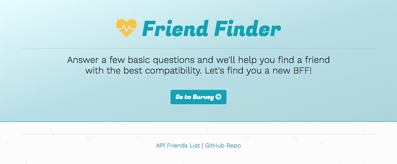
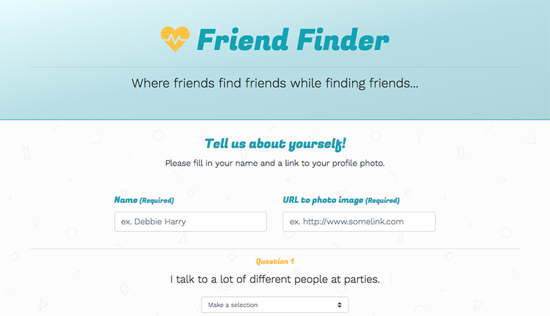
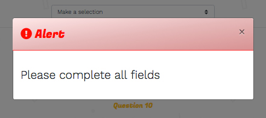
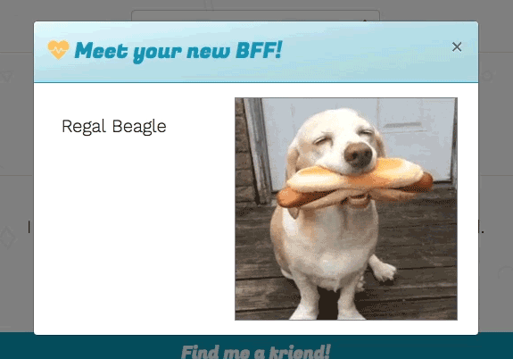

# Friend-Finder

### What is this?

A full-stack "friend finding" application based on compatibility... basically a dating app.

### How does it work?

User accesses the survey through the main button on the home page. Once on the survey page, the user is required to provide their name and a link to their profile photo. Friend Finder takes the users' survey results and compares them with the results from other users. When the user is matched with a new friend, a modal pops up with the name and picture of the user's new BFF.

Experience the app here: https://vast-brushlands-90231.herokuapp.com/

**Failure to complete all fields will result in a modal alert**

### Screenshots

##### Friend Finder - Home

##### Friend Finder - Survey

##### Friend Finder - Modal Alert (if all fields are not completed)

##### Friend Finder - Successful Friend Match

### Technologies Applied

* HTML
* Bootstrap/CSS
* Heroku
* node.js
* JavaScript
* jQuery
* Node Packages
    * Express (https://www.npmjs.com/package/express)
    * Body Parser (https://www.npmjs.com/package/body-parser)